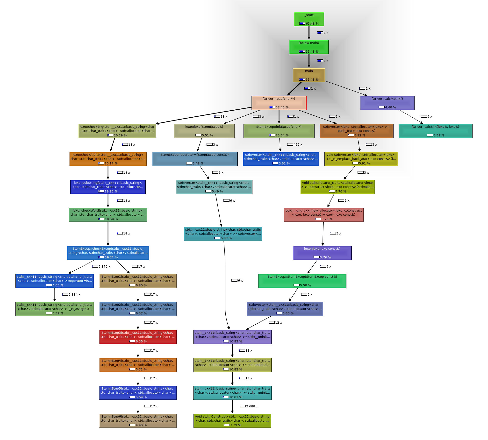

# Parallel Optimization of TF-IDF File Compariter

## Introduction

  For the project I worked on parallelizing a C++ program that I worked on in my
sophomore year. The program is meant to read text files, separate punctuation from meaningful
words, resolve capitalization, stem the words using the Porter stemming algorithm1 and a table of exceptions; and count the frequencies with which words and punctuation streams occur. From there using an algorithm known as TFIDF (Term Frequency Inverse Document Frequency)2 which will run comparisons on word counts/ occurrences in and between files to calculate a matrix of similarity scores, as defined by the TFIDF algorithm. I believe there can be a large amount of improvement to be gained using OMP.

## The Algorithm

  The algorithm is relatively simple on the surface. Every word in a document gets a TFIDF score. The TFIDF score for a word in a document is the product of two numbers: _TFIDF(word, doc) = tf(word, doc) * idf(word)_. In this equation, _tf(word, doc)_ is simply the number of times the word appears in the document. The second term is the inverse document frequency, and it is defined in terms of _N_ (the total number of documents) and _n_, the number of documents containing at least one instance of the word: _idf(word) = log10(N / n)_.

To measure the similarity between two documents, find the set of words that appear in both documents. For every word in the intersection of the documents, multiply the two TFIDF scores together, and sum those products. In other words: 
_Sim(doc1, doc2) = w TFIDF(w, doc1) * TFIDF(w, doc2)_
Where the summation is over all words (including capitalized words, etc., but excluding punctuation) that are common to both documents. This is where a majority of the computational weight is in the program.

## Program Analysis

  When breaking up the program it can fall into three major functions: File loading, File Parsing, File Comparing. So there are 3 areas that can be analyzed for performance gains. There are two problem sizes that we can influence: number of files to compare, and size/ quantity of a file to compare.
  
  

*For more information see the [Full Report](Report.pdf)*
